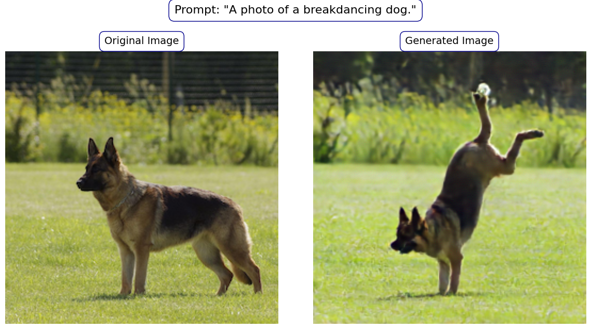
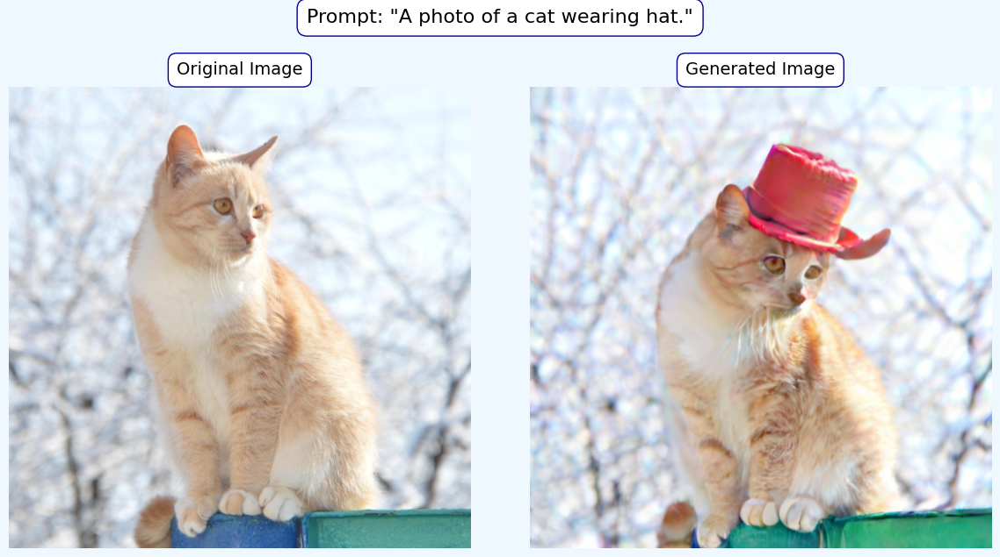
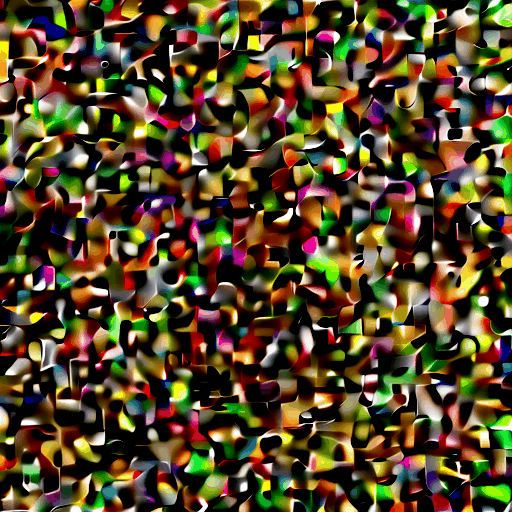

# Text-Guided-Image-Generation-CFM

This project tackles text-guided image editing — generating an image that preserves the structure of the input while aligning with a given text prompt. The task combines elements of image-to-image translation and text-to-image synthesis.

I adopt a Conditional Flow Matching (CFM) model, where the text prompt is embedded via pretrained CLIP (openAIclip-vit-base-patch16). A pretrained VAE (stabilityai/sdxl-vae) is also used to compress images into a compact latent space, making generation more efficient and stable. To further improve controllability, we apply Classifier-Free Guidance (CFG), enabling stronger adherence to the text prompt without needing extra classifiers.

## Result

| Before and After                                                           |
|--------------------------------------------------------------------------|
|  ||--------------------------------------------------------------------------|
|  |

| Noise to Image                                                             |
|--------------------------------------------------------------------------|
|  |

| Reconstructing Progress                                                     |
|----------------------------------------------------------------------------|
|  |