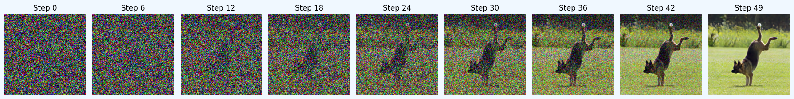

# Text-Guided-Image-Generation-CFM

Text-Guided-Image-Generation is a task that edit the input image using the given text prompt. This task is a combination of image-to-image translation and text-to-image synthesis. The goal of this task is to generate an image that is consistent with the input image but also satisfies the given text prompt. This task is challenging because it requires the model to understand the semantic meaning of the text prompt and the input image, and then generate an image that is consistent with both of them.

We use the conditional flow matching model to solve this task. The text prompt is encoded using CLIP, which is a powerful text encoder that can capture the semantic meaning of the text prompt. The output of the model is a new image that is consistent with the input image but also satisfies the text prompt.

## Result

| Before and After                                                           |
|--------------------------------------------------------------------------|
|  |

| Noise to Image                                                             |
|--------------------------------------------------------------------------|
|  |

| Reconstructing Progress                                                     |
|----------------------------------------------------------------------------|
|  |